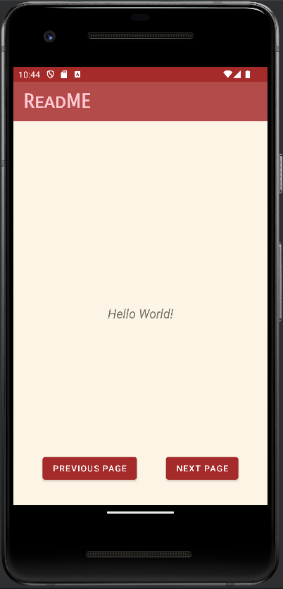
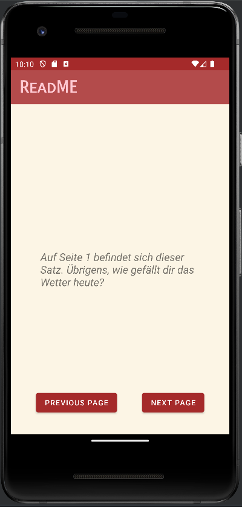

# ReadME

XYZ Corporation plant die Entwicklung einer innovativen App namens "ReadMe". 
Diese App wird speziell für das Lesen von Texten auf mobilen Geräten konzipiert sein. 
Mit ReadMe werden Nutzer in der Lage sein, ihre Lieblingstexte bequem auf ihren Smartphones 
oder Tablets zu lesen, unabhängig von ihrem Standort.

---

## Aufgabe

Erstelle die App, mit der ein Nutzer einen mehrseitigen Text lesen kann.  
Mit den Buttons `Previous Page` und `Next Page` kann der Nutzer zwischen den Seiten wechseln.  
Achte darauf, dass deine Lösung im <b>Model-View-ViewModel-Format</b> ist, wie du es in der Vorlesung
gelernt hast.  
Als Text kannst du dir einen eigenen Text ausdenken oder einen Zeitungsartikel, ein Gedicht o.ä. verwenden. 
Erstelle dafür im `Repository` eine Liste aus `Page` Objekten (Eine `Page` ist eine Seite).

### Vorlage

Als Vorlage hast du das Grundgerüst für die App, sowie die Layouts gegeben. 

    <b>Abbildung 1:</b> (links) der Screen beim Start der App, 
      (rechts) die fertige App mit der ersten Seite.

---

## Bonusaufgaben

- Erweitere die App, sodass auch die Seitenanzahl angezeigt wird.
- Erweitere die App, sodass auch ein kleines Bild pro Seite angezeigt wird.
- Erweitere die App, sodass der Nutzer den Text bearbeiten kann.
